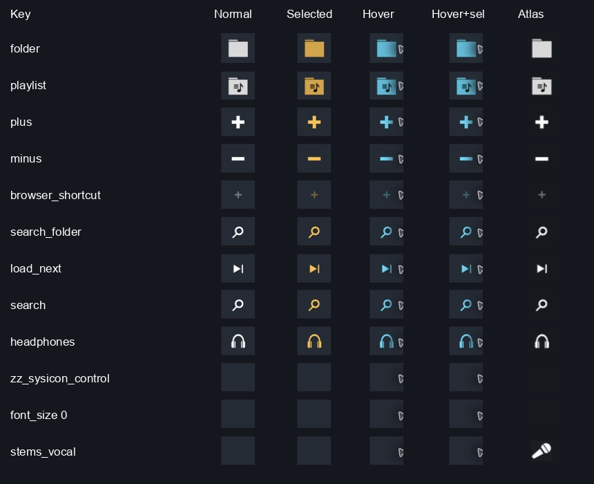

# Sysicon atlas rendering probe

**Local test, 2026-09-15 Asia/Manila, VirtualDJ 18.0.9598 arm64 on macOS.**
The explicit `<icon sysicon="…"/>` path renders `folder`, `playlist`, `plus`,
`minus`, `browser_shortcut`, `search_folder`, and `load_next` with glyphs matching
their predicted atlas cells in this named fixture. All retain their glyphs in
normal, selected, hover, and selected-hover states.

**Interpretation correction, 2026-09-15:** blank output is an observation, not
proof that a key is unrecognized or unsupported. The effective runtime atlas
was not independently identified. A replaced/transparent cell or another
drawing-path issue remains a possible explanation. The fixture has no explicit
`customicons` declaration, its installed XML/PNG match the captured files, and
the bundled reference cell is nontransparent; those checks do not establish
which runtime cell was actually selected. Earlier wording calling this a
"negative" must be read only as a blank-rendering observation.

## Method and scope

- `skin.xml` is the exact revision-2 fixture. Buttons have `action="nothing"`;
  candidate strings occur only in `sysicon`. `query="off"` and `query="on"`
  independently force normal and selected states. No candidate verb executes.
- The installed build's `Resources/icons.png` supplies the reference. The
  atlas hash, dimensions, index per candidate, and fixture hash are in
  `fixture.json`. No `customicons` override is used.
- `load_skin 'ZZ Sysicon Atlas Probe/:skin'` switches to the installed fixture;
  the `load_skin` query and visible revision header verify the switch.
  Immediate query readback once still showed the old skin; subsequent visible
  observation and query showed the fixture. Execute return `true` is not used
  as proof of a switch.
- App screenshots are from computer-use capture at 1229 × 768. The first
  mouse pass clicked button centers; `hover-*.png` preserves those captures.
  The repeat pass clicked each button's right edge, keeping the cursor off the
  glyph: x=475 or 618, y=150+47.4×row, zero-based. `edge-hover-*.png` captures
  those states. Each click executes only `nothing`.
- `normal-selected.png` is the complete baseline. `comparison.png` is a
  contact sheet of unmodified screenshot crops, reproducible with
  `python3 tests/Skins/SysiconAtlasProbe/summarize_captures.py`.
- The reference comparison is visual glyph identity, not pixel equality:
  rendered keys are recolored; direct atlas crops retain original RGB. The
  gold bitmap column uses alpha-only silhouettes, so it loses opaque internal
  detail (notably the playlist symbol). It is not an exact selected-state oracle.
- The original skin identity was independently read before testing and after
  final restoration, and the original UI was visually observed again. Private
  library/track screenshots are not saved with the evidence. The inactive test
  fixture remains installed for reproduction.

## Observed results

| Explicit key | Result in this fixture | Atlas correspondence |
| --- | --- | --- |
| `folder` | Folder glyph; normal/selected/hover/selected-hover | C1 / index 32 |
| `playlist` | Folder containing playlist/music symbol; all tested states | C6 / index 37 |
| `plus` | Plus glyph; all tested states | E1 / index 64 |
| `minus` | Minus glyph; all tested states | E2 / index 65 |
| `browser_shortcut` | Small, dim plus glyph; all tested states | E12 / index 75 |
| `search_folder` | Magnifying glass matching `search`; all tested states | E5 / index 68 |
| `load_next` | Triangle followed by vertical bar; all tested states | H13 / index 124 |
| `search` | Positive control renders a magnifying glass | E5 / index 68 |
| `headphones` | Positive control renders headphones | E6 / index 69 |
| `zz_sysicon_control` | Blank in all tested states | Negative control |
| `font_size 0` | Blank in all tested states | Non-key literal control |
| `stems_vocal` | Blank in all tested states despite a nonempty reference cell; cause unresolved | Blank-rendering observation |

The local image's index 144 is its tenth physical row, labelled J1 by this
fixture's sequential lettering. The wiki calls its stems row K. This is a row
labelling discrepancy; do not silently treat the two letters as the same grid.
The capture establishes only that this exact `stems_vocal` form rendered
blank here. Other stems names, paths, builds and custom atlas configurations
were not tested.

## Failed first comparison, preserved

Revision 1 successfully rendered the keys but all coordinate-icon reference
crops appeared as solid squares. `revision-1-invalid-crops.png` is retained;
it cannot establish atlas matches. Revision 2 uses direct `<visual><off x=…
y=…/></visual>` bitmap references instead. This avoids relying on unverified
coordinate-icon masking semantics. Do not promote an explanation of the
revision-1 mask failure to fact without its own discriminating test.

## Reproduction and next work

Run `just doctor`, then `python3 tests/Skins/SysiconAtlasProbe/generate.py`
(Pillow required). The generator refuses another build to preserve this dated
fixture. Install `skin.xml` and `skin.png` together under a skin folder named
`ZZ Sysicon Atlas Probe`. Record the current `load_skin` query before switching,
then restore that exact identity and verify it by query and UI afterward.

For future agents, use `results.json` and the contact sheet first. The next
useful test is an explicitly supplied diagnostic atlas with visible markers
in every cell, verifying replacement with known keys before interpreting any
blank candidate. Trace the selected runtime cell if needed to separate lookup
from drawing. Additional suffix/prefix spellings remain untested. Do not
rerun the confirmed rows merely to rediscover their names.
