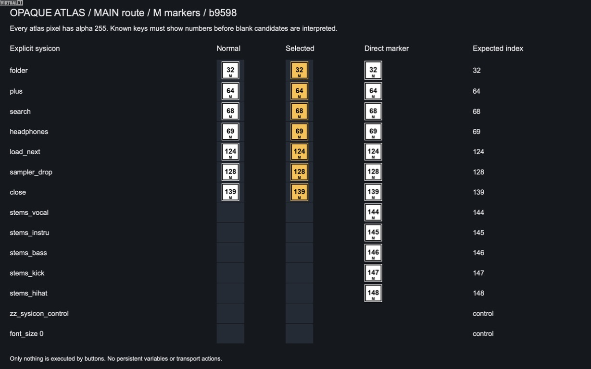

# Opaque sysicon atlas control

**Local test: 2026-09-15 Asia/Manila, VirtualDJ 18.0.9598 arm64, macOS.**
This follows the atlas-provenance objection to the earlier
[blank stems observation](../SysiconAtlasProbe/README.md).

- Both explicit atlas replacement routes took effect for the positive controls.
- The separate PNG displayed numbered `F` markers; the main skin PNG displayed
  numbered `M` markers at the same known-key positions.
- `stems_vocal`, `stems_instru`, `stems_bass`, `stems_kick`, and `stems_hihat`
  remained blank with both replacements, in normal and selected states.
- Every supplied cell was fully opaque. This excludes a transparent cell in
  these supplied PNGs as the cause. It does **not** independently establish
  that every high-index cell was installed, or which runtime pointer a stems
  key selected. Key recognition remains distinct from rendering.



## Exact fixture

`generate.py` creates 160 numbered cells for this dated b9598 experiment,
64 × 64 pixels each, in sixteen columns. Every pixel has alpha 255, including
cell backgrounds. Number and route letter are black on white. The two modes
use these declarations:

```xml
<customicons file="markers.png" x="0" y="0" iconsize="64" nb="160" nbx="16"/>
```

```xml
<customicons x="0" y="800" iconsize="64" nb="160" nbx="16"/>
```

The second grid is embedded in `skin.png`. The installed main-mode fixture
contains only `skin.xml` and `skin.png`, with no separate `markers.png`.
The file-mode fixture contains those files plus `markers.png`.

Every candidate is an explicit `sysicon` attribute, not an executed action.
Buttons execute `nothing`; `query="off"` and `query="on"` independently
supply normal and selected states. No custom variables, transport actions or
media mutations are used. The direct marker column is a bitmap reference,
not evidence that a particular runtime cell was installed.

## Observations

| Explicit key | File override | Main-PNG override |
| --- | --- | --- |
| `folder` | 32 F | 32 M |
| `plus` | 64 F | 64 M |
| `search` | 68 F | 68 M |
| `headphones` | 69 F | 69 M |
| `load_next` | 124 F | 124 M |
| `sampler_drop` | 128 F | 128 M |
| `close` | 139 F | 139 M |
| `stems_vocal` | Blank | Blank |
| `stems_instru` | Blank | Blank |
| `stems_bass` | Blank | Blank |
| `stems_kick` | Blank | Blank |
| `stems_hihat` | Blank | Blank |
| `zz_sysicon_control` | Blank | Blank |
| `font_size 0` | Blank | Blank |

Both normal and selected columns displayed those results. This test did not
exercise hover. The main image visibly changed each control's letter from F
to M; stale use of the first diagnostic atlas does not explain that result.
The supplied atlas range covers the stems indices hypothesized from the
bundled image, but no working key independently selected those high cells.

## Capture, reproduction and restoration

Run `just doctor`, then `python3 tests/Skins/SysiconMarkerProbe/generate.py`
(Pillow required). The generator refuses other builds. `fixture.json` records
fixture hashes and marker properties. `results.json` records the observations,
capture hashes, exact load actions, and scope limits.

Install the `file` fixture as `ZZ Sysicon Markers File`, and the `main` fixture
as `ZZ Sysicon Markers Main`. Record `load_skin` before switching. This run used:

```text
load_skin 'ZZ Sysicon Markers File/:skin'
load_skin 'ZZ Sysicon Markers Main/:skin'
load_skin 'DeathDisco Grave Raver v1/:skin'
```

Separate `load_skin` queries returned the respective identities; app screenshots
verified the visible F/M fixtures. The original UI was observed again after
restoration, and a final query returned the original identity. Private media
screenshots were not retained. Both diagnostic fixtures remain installed but
inactive. Do not use the literal restore identity above for another session;
restore that session's independently recorded original skin instead.

For future agents, start with `results.json` and the two captures. Repeating
blank-only tests without verified atlas controls adds little. The next useful
step is to trace the runtime icon pointer/selected index for the stems keys,
or inspect the atlas loader's accepted range, to distinguish lookup failure
from an unassigned or suppressed drawing object.
